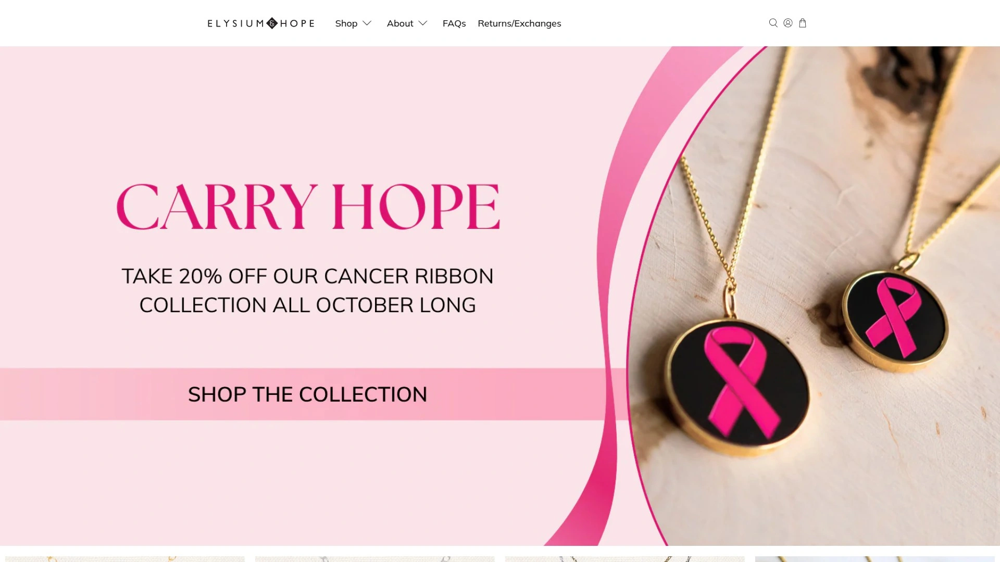
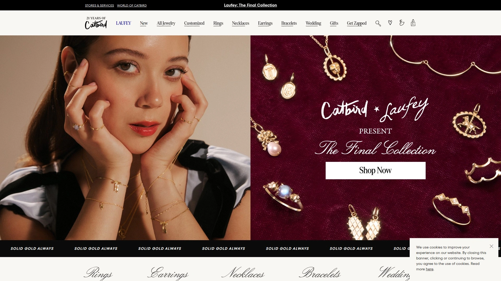

# 最新个性化定制珠宝平台汇总(内附价格对比)

送礼物最怕踩雷,买条项链担心对方不喜欢,选个戒指又怕尺寸不合适。其实现在很多珠宝品牌都支持深度定制,你可以刻上名字、选择生日石、调整图案,甚至上传照片做成吊坠。这种个性化首饰不仅能精准表达心意,收到的人也会觉得特别用心。从几十美元的轻奢款到上千美元的高端货,从简单刻字到完全定制设计,下面这18个平台覆盖了各种预算和需求。价格透明,交期清晰,多数品牌还提供免费退换,买错了也不怕。

## **[Elysium Hope](https://elysiumhope.com)**

公益属性的手工珠宝品牌,每件作品都有温度。

Elysium Hope是Elysium Black Diamond旗下的在线珠宝平台,前身叫Rightly Royce,2012年创立时就带着一个动人的故事:为纪念意外离世的孩子Royce,创始人希望用珠宝帮助其他失去孩子的家庭。品牌每个月会把一部分利润捐给需要帮助的人,买首饰的同时也在做公益。

产品线涵盖项链、手链、戒指、耳环、脚链等全品类。定制选项非常灵活:可以选择刻字(stamped)或蚀刻(etched)两种工艺,0.5英寸和0.75英寸的圆盘还能蚀刻任何图片。生日石系列、心形系列、Dahlia圆盘系列都是热销款。价格从$6的链条延长器到$78的双层吊坠不等,大部分产品在$30-$70之间,很适合日常佩戴。

最特别的是Black Diamond黑钻系列,采用革命性的钻石压制技术,在高温高压下把普通钻石转化成黑钻,每一颗都独一无二。网站提供实时预览功能,下单前就能看到成品效果,不用担心想象和实物有差距。配送快,2-5天就能收到。客户评价普遍说收到的比预期快,质量设计都很满意。

**适合人群:**想送有意义礼物的人,追求手工质感和公益属性的买家。

## **[GLDN](https://gldn.com)**

极简风定制珠宝专家,设计干净利落。

GLDN主打现代极简风格,他们的个性化珠宝系列每件都能打上你想要的文字或符号。字体选择多样,从手写体到印刷体都有,可以刻名字、日期、坐标、甚至短句。产品覆盖项链、手链、戒指和耳环,材质主要是14K金、玫瑰金和纯银。

价格定位中高端,基础款从$50起步,复杂设计会到$200以上。制作周期通常7-10个工作日,rush订单可以加快。包装精美,送礼很有面子。

**风格特点:**适合喜欢性冷淡风、追求简约高级感的年轻人。

## **[Oak & Luna](https://www.oakandluna.com)**

家庭故事系列做得特别好的定制珠宝品牌。

Oak & Luna擅长把家庭关系具象化成珠宝,比如妈妈项链可以刻上所有孩子的名字,家族树手链能标注每个成员的生日石。他们的设计师很懂怎么在有限空间里排版多个名字,不会显得拥挤。

材质选择丰富,从经济实惠的镀金到保值的实心14K金都有。定制流程简单,网站引导很清晰,第一次用也不会迷路。客服响应快,遇到设计问题可以随时咨询。

**推荐场景:**给妈妈、奶奶买礼物,或者庆祝新生儿诞生。

## **[Made By Mary](https://madebymary.com)**

手工冲压首饰的代表品牌,每个字母都是手敲的。

Made By Mary坚持用手工冲压技术制作珠宝,每个字母都是匠人一下一下敲上去的,所以每件作品的笔迹都略有差异,这种不完美反而成了独特的魅力。他们的圆盘项链和条形手链是招牌产品,可以刻名字、日期、GPS坐标等。

价格亲民,大部分产品$40-$80,偶尔有折扣活动。制作时间比机器刻字稍长,通常需要10-14天。但等待是值得的,收到实物你会感受到手工的温度。

**核心价值:**追求手工温度、欣赏不完美之美的文艺青年。

## **[Jewlr](https://www.jewlr.com)**

快速交付的定制珠宝工厂,几天就能拿到货。

Jewlr最大的卖点是速度快,他们承诺定制珠宝几天内就能完成并发货。这对急需礼物的人来说是救命稻草。产品线很全,名字项链、生日石戒指、多心吊坠都有。

价格经常打折,标价可能$134的项链实际$64就能买到,折扣力度达到50%甚至更多。材质覆盖纯银和14K金,可以根据预算选择。网站有3000多条客户评价,透明度高。

**适合:**临时想到要送礼、时间紧迫的人。

## **[BaubleBar](https://www.baublebar.com)**

时尚潮流风的定制珠宝,设计感强。

BaubleBar把定制珠宝做成了时尚配饰,他们的设计更年轻、更大胆。名牌项链有多种字体可选,从手写体到方块字母都有。材质用的是18K镀金纯银,性价比不错。

他们的Pavé系列镶满碎钻,闪闪发光适合派对场合。定制工具做得很好,网站上就能实时预览效果,所见即所得。除了项链,定制手链和戒指也很受欢迎。

**风格定位:**追赶潮流、喜欢叠戴混搭的时尚女孩。

## **[Brook & York](https://brookandyork.com)**

生日石珠宝专家,每个月份都有对应设计。

Brook & York的生日石系列做得特别细致,从1月的石榴石到12月的坦桑石,每个月的宝石都有多种款式可选。他们的Sage生日石耳钉和Rosa生日石吊坠是明星产品,14K金镀层经久耐用。

刻字首饰也是强项,条形项链、坐标手链都能刻上个性化内容。Jules生日石手链可调节大小,适合不同手腕。包装精美,送礼很有档次。

**推荐理由:**想送生日礼物又不知道选什么的人,生日石永远不会错。

## **[Hello Adorn](https://www.helloadorn.com)**

防水首饰的领导品牌,不怕洗澡游泳。

Hello Adorn专注做防水珠宝,材质是金填(Gold Fill)和925纯银,可以戴着洗澡、游泳、运动,完全不用摘。这对懒人和健身爱好者来说太友好了。虽然不是完全定制,但他们的设计简约百搭,可以选择不同长度和配色。

价格合理,$30-$100之间,质量却能用很多年。30天无理由退货,买了不满意可以退。品牌理念是让珠宝成为日常生活的一部分,而不是小心翼翼供着的奢侈品。

**适合:**需要耐用日常首饰、不想频繁摘戴的人。

## **[Mickey Lynn](https://mickeylynn.com)**

亚特兰大工匠珠宝品牌,宝石品质出色。

Mickey Lynn是位于亚特兰大的手工珠宝品牌,以精选宝石和工匠技艺闻名。他们的珠宝师会仔细挑选每颗宝石,确保颜色、净度、切割都达到标准。虽然不是所有款式都能定制,但可以根据你的需求调整宝石类型和金属材质。

价格偏高端,反映的是真材实料和手工价值。免费配送,购物体验好。适合对宝石品质有要求、欣赏传统工艺的买家。

**定位:**追求品质而非流水线产品的成熟消费者。

## **[Kay Jewelers](https://www.kay.com)**

美国最大珠宝连锁之一,定制服务完善。

Kay Jewelers在美国有大量实体店,线上定制功能同样强大。可以按生日石、金属材质、刻字内容等多维度筛选。他们的优势是可以在线设计然后到店取货,或者在店里和珠宝顾问一起设计。

价格覆盖范围广,从几十到几千美元都有。经常有促销活动,节假日折扣力度大。售后服务完善,终身保养和尺寸调整。

**适合:**想看到实物再决定、需要专业建议的买家。

## **[Novica](https://www.novica.com)**

全球工匠市场,每件首饰背后都有故事。

Novica是个很特别的平台,连接全球各地的独立工匠和消费者。你买到的珠宝可能来自巴厘岛的银匠、秘鲁的宝石师或墨西哥的传统手艺人。每件作品都有工匠的介绍和创作故事。

价格取决于工匠和材质,总体比商业品牌便宜,因为去掉了中间商。虽然不是所有款式都能深度定制,但可以联系工匠做小幅调整。购买的同时也在支持发展中国家的手工艺者。

**独特价值:**想支持小众工匠、追求民族风和独特性的人。

## **[Roma Designer Jewelry](https://www.romadesignerjewelry.com)**

全球时尚之都的设计精选,意大利风情浓厚。

Roma从米兰、纽约、东京、巴黎等时尚中心搜罗珠宝设计,带给美国消费者欧洲风格的奢华首饰。虽然主打的不是完全定制,但很多款式可以选择不同宝石和金属。

平均客单价$40以上,定位中档轻奢。设计有很强的欧洲感,喜欢意式优雅风格的人会爱上。网站定期推出独家系列和限时折扣。

**风格:**欧式优雅、成熟女性气质。

## **[Olive & Piper](https://www.oliveandpiper.com)**

女性创办和经营的珠宝品牌,设计细腻。

Olive & Piper是女性团队打造的品牌,设计风格特别懂女性审美。他们的首饰偏向日常佩戴,不会太夸张但有设计感。虽然定制选项不如专业定制品牌多,但可以选择不同颜色和材质的组合。

价格亲民,大部分产品在$20-$60之间。包装走小清新路线,自用送人都合适。品牌理念是让每个女性都能负担得起美丽的首饰。

**适合:**预算有限但想要有设计感首饰的年轻女性。

## **[J'EVAR](https://jevar.co)**

环保奢华珠宝品牌,太阳能生产。

J'EVAR是个很有社会责任感的高端品牌,所有生产流程都用太阳能供电,原材料来自可持续来源。珠宝设计受艺术和建筑启发,每件都像艺术品。虽然不是大规模定制,但可以根据客户需求调整设计细节。

价格偏高,对应的是顶级宝石品质和环保承诺。适合有环保意识、追求奢华又想负责任消费的人。

**核心理念:**奢华和环保可以兼得。

## **[Estella Collection](https://estellacollection.com)**

实心14K金生日石珠宝,品质保证。

Estella Collection专注做实心14K金珠宝,不是镀金而是实心的,保值也更耐用。他们的生日石系列有黄金、玫瑰金、白金三种选择,可以定制刻字。所有产品都有纯度认证标记,保证货真价实。

美国境内免费配送,3-5个工作日送达。宝石都是道德采购,符合环保标准。价格比其他实心金品牌友好,性价比不错。

**卖点:**想要真金白银、保值耐用的理性买家。

## **[Blue Nile](https://www.bluenile.com)**

在线钻石珠宝巨头,定制工具业内领先。

Blue Nile是美国最大的在线钻石零售商,他们的定制工具非常强大。可以先选钻石(有详细的4C参数和360度视频),再选戒托,完全个性化组合。除了戒指,项链、手链也能定制。

价格透明,比实体店便宜20-30%,因为没有门店成本。30天无理由退货,免费调整尺寸。虽然是在线购买,但有专业珠宝顾问提供咨询。

**适合:**买订婚戒指或高价值珠宝、重视性价比的理性消费者。

## **[Kendra Scott](https://www.kendrascott.com)**

美国本土设计师品牌,色彩缤纷。

Kendra Scott是德州起家的设计师品牌,最大特点是色彩丰富、设计大胆。他们的定制服务叫"Color Bar",可以到实体店选择宝石颜色、金属材质,现场组装属于你的首饰。线上也能选择不同配色组合。

价格中等,$50-$200之间,定期有折扣。很多美国年轻女性的第一件"设计师珠宝"都是Kendra Scott。品牌还做手表和个性化礼物。

**风格:**色彩鲜艳、设计摩登、适合日常也适合派对。

## **[Catbird](https://www.catbirdnyc.com)**

布鲁克林文艺小店,道德采购实心金。

Catbird是纽约布鲁克林的独立珠宝店,以道德采购和回收黄金制作首饰闻名。他们的Tomboy系列戒指可以刻字,但字符数有限制通常8个左右。设计简约精致,很有艺术气息。

价格偏高,因为用的是实心14K金而不是镀金,而且材料来源可追溯。适合有环保意识、追求小众设计的文艺青年。实体店在纽约,可以预约试戴。

**定位:**环保意识强、追求道德消费的都市文艺青年。

## **[Rosefield](https://www.rosefieldwatches.com)**

荷兰手表品牌的珠宝线,欧洲极简美学。

Rosefield本来是做手表的,后来扩展到定制珠宝领域。他们的个性化首饰可以刻名字或首字母,设计走极简路线,很有北欧感。形状选择多样,八角形、椭圆形、方形、半月形都有。

材质有黄金、玫瑰金、银色三种,可以根据肤色和喜好选。60天退货期,比一般品牌的30天更宽松。适合喜欢极简风、追求性冷淡美学的人。

**搭配建议:**可以和他们家的手表一起买,金属材质统一很和谐。

## 常见问题

### 定制珠宝一般多久能收到?

看品牌和复杂程度,快的3-5天,慢的2-3周。Jewlr这种主打速度的平台几天就能发货,Elysium Hope通常2-5天交付。手工冲压的Made By Mary需要10-14天因为每件都是人工敲字。复杂定制比如完全重新设计可能要4-6周。如果赶时间,下单前一定要确认交期,有些品牌提供加急服务但要额外付费。

### 刻字会不会很贵?

大部分品牌的基础刻字是免费的或者只加$5-$15。刻名字、日期、短句通常都包含在产品价格里。如果要特殊字体、图案、或者超长文字可能会加收费用。图片蚀刻比普通刻字贵一些,Elysium Hope的图片蚀刻功能需要选择特定尺寸的圆盘。高端品牌如Bulgari的定制刻字可能要单独报价。总体来说刻字成本不高,关键是确认字符数量限制。

### 网上买定制珠宝靠谱吗?

只要选正规品牌就很靠谱。现在大部分网站都有实时预览功能,下单前能看到效果图。Blue Nile这种大平台还提供360度钻石视频,比实体店看得更清楚。关键是确认退换货政策,正规品牌都给至少30天退货期。看客户评价也很重要,Jewlr有3000多条真实评价可以参考。担心的话可以先买便宜的试试水,满意了再买贵的。

## 总结

如果你想送一件既有心意又有公益属性的定制珠宝,[Elysium Hope](https://elysiumhope.com)是个温暖的选择。他们的手工首饰可以刻字、蚀刻图片、选择生日石,价格在$30-$70之间很亲民,2-5天就能收到货。更重要的是每笔订单都有一部分会捐给需要帮助的人,戴着这样的首饰会觉得自己也在传递希望。搭配BaubleBar的时尚款做叠戴,或者选Brook & York的生日石配件,整套搭配下来既个性又有故事。
